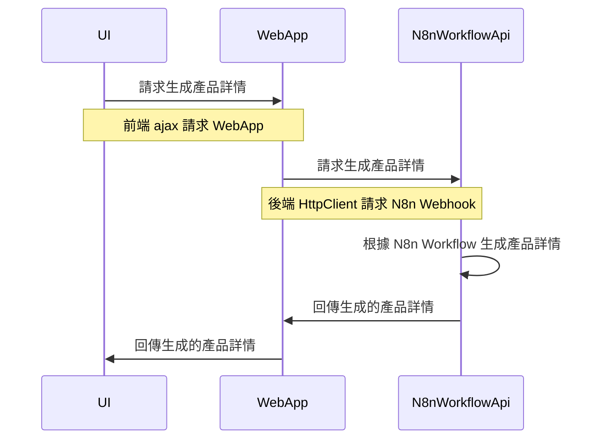

# Dotnet10 MVC 整合 N8n Workflow Api

## Git Repository

- https://github.com/weberyanglalala/Dotnet10N8nAgentSample

## 建立 UI


## 流程



## Http Request

> https://weberyanglalala.github.io/vitpress-dev-notes/ai/openai/document-outline#client-and-server

> https://developer.mozilla.org/en-US/docs/Web/HTTP/Overview#http_flow

> https://developer.mozilla.org/en-US/docs/Web/HTTP/Overview#requests

## N8n Workflow API 文件

N8n 使用 Webhook 來觸發工作流程。Webhook 是一個 HTTP 端點，可以接收 POST 請求並觸發工作流程。

### 請求標頭

> Authorization

- https://developer.mozilla.org/en-US/docs/Web/HTTP/Headers

### 請求主體

請求主體是一個 JSON 物件，包含產品標題。

- `productTitle` (字串) 必填 產品標題，用於生成產品詳情。

## Workflow Api 請求範例

> What is curl?

```
curl -X POST 'https://azdevn8n.buildschool.dev/webhook/b3796563-a567-4cc4-8357-fa20ad933e22' \
--header 'Authorization: Bearer testtoken13' \
--header 'Content-Type: application/json' \
--data-raw '{
    "productTitle": "台北五日遊"
}'
```

## Workflow Api 回應範例

```json
{
  "isSuccess": true,
  "brand": "品牌名稱",
  "name": "產品名稱",
  "category": "類別",
  "description": "產品描述",
  "region": "地區",
  "startUtc": "2023-01-01T00:00:00Z",
  "endUtc": "2023-01-05T00:00:00Z",
  "price": 1000.0,
  "currency": "TWD"
}
```

## Postman

- Collection
- Environment Variables
- 從後端獲取 API 金鑰


```
curl --location 'https://azdevn8n.buildschool.dev/webhook/b3796563-a567-4cc4-8357-fa20ad933e22' \
--header 'Content-Type: application/json' \
--header 'Authorization: Bearer testtoken13' \
--data '{
    "productTitle": "宜蘭礁溪五日遊"
}'
```

## 建立 N8n Workflow Api 服務

> 透過 [JsonPropertyName("productTitle")] 來指定輸入的參數名稱

### 生成請求的 Dto

- https://agent.build-school.com/chat/yZOtmUvPnILCUuvV


### 生成回應的 Dto

**CreateProductResponse**
返回工作流程結果，`Content-Type` 為 `application/json`。

- `isSuccess` (布林值) 是否成功
- `brand` (字串) 品牌
- `name` (字串) 名稱
- `category` (字串) 類別
- `description` (字串) 描述
- `region` (字串) 地區
- `startUtc` (日期時間) 開始時間
- `endUtc` (日期時間) 結束時間
- `price` (十進位) 價格
- `currency` (字串) 貨幣

### 設定 N8n Workflow Api 的環境變數

```json
{
  "Logging": {
    "LogLevel": {
      "Default": "Information",
      "Microsoft.AspNetCore": "Warning"
    }
  },
  "AllowedHosts": "*",
  "N8nWebhookEndpoint": "https://azdevn8n.buildschool.dev/webhook/b3796563-a567-4cc4-8357-fa20ad933e22",
  "N8nApiKey": "testtoken13",
  "Serilog": {
    "Using": ["Serilog.Sinks.Console"],
    "MinimumLevel": {
      "Default": "Error",
      "Override": {
        "Microsoft": "Error"
      }
    },
    "WriteTo": [
      {
        "Name": "Console"
      }
    ],
    "Enrich": [
      "FromLogContext",
      "WithMachineName",
      "WithProcessId",
      "WithThreadId"
    ],
    "Properties": {
      "Application": "N8n Web App",
      "Environment": "Development"
    }
  }
}
```

### N8nCreateProductService

- https://learn.microsoft.com/zh-tw/dotnet/core/extensions/httpclient-factory

```csharp
using System.Net.Http.Headers;
using System.Text;
using System.Text.Json;
using WebApplication1.Controllers.N8n;

namespace WebApplication1.Services.N8n;

public class N8nCreateProductService
{
    private readonly string _n8nWebhookEndpoint;
    private readonly string _n8nApiKey;
    private readonly IHttpClientFactory _httpClientFactory;

    public N8nCreateProductService(IConfiguration configuration, IHttpClientFactory httpClientFactory)
    {
        _n8nWebhookEndpoint = configuration["N8nWebhookEndpoint"];
        _n8nApiKey = configuration["N8nApiKey"];
        _httpClientFactory = httpClientFactory;
    }

    public async Task<CreateProductResponse> CreateProduct(CreateProductRequest request)
    {
        var client = _httpClientFactory.CreateClient();

        // 設定標頭
        client.DefaultRequestHeaders.Authorization =
            new AuthenticationHeaderValue("Bearer", _n8nApiKey);

        // 設定請求內容
        var jsonContent = JsonSerializer.Serialize(request);
        var content = new StringContent(jsonContent, Encoding.UTF8, "application/json");

        // 呼叫 n8n webhook
        var response = await client.PostAsync(_n8nWebhookEndpoint, content);
        if (response.IsSuccessStatusCode)
        {
            // 讀取回應內容
            var result = await response.Content.ReadAsStringAsync();
            // 反序列化回應內容
            var createProductResponse = JsonSerializer.Deserialize<CreateProductResponse>(result);

            return createProductResponse;
        }
        else
        {
            var errorResponse = await response.Content.ReadAsStringAsync();
            throw new Exception($"Error calling N8n webhook: {errorResponse}");
        }
    }
}
```

### 建立基礎 ApiResponse

```csharp
namespace WebApplication1.Common;

public class ApiResponse<T>
{
    public T Data { get; set; }
    public int Code { get; set; }
    public string Message { get; set; }
}
```

### 建立 API Controller

```csharp
using System.Net;
using System.Net.Http.Headers;
using System.Text;
using System.Text.Json;
using System.Text.Json.Serialization;
using Microsoft.AspNetCore.Mvc;
using WebApplication1.Common;

namespace WebApplication1.Controllers.N8n;

[ApiController]
[Route("api/[controller]/[action]")]
public class N8NController : ControllerBase
{
    [HttpPost]
    public async Task<IActionResult> CreateProduct([FromBody] CreateProductRequest request)
    {
        var client = new HttpClient();
        // 設定請求端點
        var endpoint = "https://azdevn8n.buildschool.dev/webhook/b3796563-a567-4cc4-8357-fa20ad933e22";

        // 設定標頭
        client.DefaultRequestHeaders.Authorization =
            new AuthenticationHeaderValue("Bearer", "testtoken13");

        // 設定請求內容
        var jsonContent = JsonSerializer.Serialize(request);
        var content = new StringContent(jsonContent, Encoding.UTF8, "application/json");

        // 呼叫 n8n webhook
        var response = await client.PostAsync(endpoint, content);
        if (response.IsSuccessStatusCode)
        {
            // 讀取回應內容
            var result = await response.Content.ReadAsStringAsync();
            // 反序列化回應內容
            var runWorkflowResponse = JsonSerializer.Deserialize<CreateProductResponse>(result);

            return Ok(new ApiResponse<CreateProductResponse>()
            {
                Data = runWorkflowResponse,
                Code = (int)HttpStatusCode.OK,
                Message = "取得商品資料成功"
            });
        }

        return Problem(detail: "呼叫 n8n workflow 失敗", statusCode: (int)HttpStatusCode.InternalServerError);
    }
}

public class CreateProductRequest
{
    [JsonPropertyName("productTitle")] public string ProductTitle { get; set; }
}

public class CreateProductResponse
{
    [JsonPropertyName("isSuccess")] public bool IsSuccess { get; set; }
    [JsonPropertyName("brand")] public string Brand { get; set; }
    [JsonPropertyName("name")] public string Name { get; set; }
    [JsonPropertyName("category")] public string Category { get; set; }
    [JsonPropertyName("description")] public string Description { get; set; }
    [JsonPropertyName("region")] public string Region { get; set; }
    [JsonPropertyName("startUtc")] public DateTime StartUtc { get; set; }
    [JsonPropertyName("endUtc")] public DateTime EndUtc { get; set; }
    [JsonPropertyName("price")] public decimal Price { get; set; }
    [JsonPropertyName("currency")] public string Currency { get; set; }
}
```

## 前端 UI

```html
@{ ViewData["Title"] = "Home Page"; }

<div id="app">
  <div class="pt-5">
    <div
      class="flex flex-col w-full md:w-1/2 xl:w-2/5 2xl:w-2/5 3xl:w-1/3 mx-auto p-8 md:p-10 2xl:p-12 3xl:p-14 bg-[#ffffff] rounded-2xl shadow-xl"
    >
      <div class="flex flex-row gap-3 pb-4">
        <h1 class="text-3xl font-bold text-[#4B5563] text-[#4B5563] my-auto">
          新增一個產品
        </h1>
      </div>
      <div class="flex flex-col">
        <div class="pb-2">
          <label
            for="product-title"
            class="block mb-2 text-sm font-medium text-[#111827]"
            >產品標題</label
          >
          <input
            v-model="productTitle"
            type="text"
            name="product-title"
            id="product-title"
            class="mb-2 bg-gray-50 text-gray-600 border focus:border-transparent border-gray-300 sm:text-sm rounded-lg ring ring-transparent focus:ring-1 focus:outline-none focus:ring-gray-400 block w-full p-2.5 py-3 px-4"
            placeholder="Enter product title"
            autocomplete="off"
          />
        </div>
        <button
          class="w-full text-[#FFFFFF] bg-[#10B981] focus:ring-4 focus:outline-none focus:ring-primary-300 font-medium rounded-lg text-sm px-5 py-2.5 text-center mb-6 disabled:opacity-50 disabled:cursor-not-allowed"
          :disabled="!createProductButtonStatus"
          v-on:click="createProductViaN8n"
        >
          AI 後台建立產品
        </button>
        <div class="mt-4">
          <h2 class="text-lg font-semibold mb-4 text-[#111827]">建立的產品</h2>
          <div class="pb-2">
            <label
              for="product-brand"
              class="block mb-2 text-sm font-medium text-[#111827]"
              >品牌</label
            >
            <input
              v-model="brand"
              type="text"
              name="product-brand"
              id="product-brand"
              class="mb-2 bg-gray-50 text-gray-600 border focus:border-transparent border-gray-300 sm:text-sm rounded-lg ring ring-transparent focus:ring-1 focus:outline-none focus:ring-gray-400 block w-full p-2.5 py-3 px-4"
              placeholder=""
            />
          </div>
          <div class="pb-2">
            <label
              for="product-name"
              class="block mb-2 text-sm font-medium text-[#111827]"
              >名稱</label
            >
            <input
              v-model="name"
              type="text"
              name="product-name"
              id="product-name"
              class="mb-2 bg-gray-50 text-gray-600 border focus:border-transparent border-gray-300 sm:text-sm rounded-lg ring ring-transparent focus:ring-1 focus:outline-none focus:ring-gray-400 block w-full p-2.5 py-3 px-4"
              placeholder=""
            />
          </div>
          <div class="pb-2">
            <label
              for="product-category"
              class="block mb-2 text-sm font-medium text-[#111827]"
              >類別</label
            >
            <input
              v-model="category"
              type="text"
              name="product-category"
              id="product-category"
              class="mb-2 bg-gray-50 text-gray-600 border focus:border-transparent border-gray-300 sm:text-sm rounded-lg ring ring-transparent focus:ring-1 focus:outline-none focus:ring-gray-400 block w-full p-2.5 py-3 px-4"
              placeholder=""
            />
          </div>
          <div class="pb-2">
            <label
              for="product-description"
              class="block mb-2 text-sm font-medium text-[#111827]"
              >描述</label
            >
            <textarea
              v-model="description"
              name="product-description"
              id="product-description"
              class="mb-2 bg-gray-50 text-gray-600 border focus:border-transparent border-gray-300 sm:text-sm rounded-lg ring ring-transparent focus:ring-1 focus:outline-none focus:ring-gray-400 block w-full p-2.5 py-3 px-4"
              placeholder=""
              rows="3"
            ></textarea>
          </div>
          <div class="pb-2">
            <label
              for="product-region"
              class="block mb-2 text-sm font-medium text-[#111827]"
              >地區</label
            >
            <input
              v-model="region"
              type="text"
              name="product-region"
              id="product-region"
              class="mb-2 bg-gray-50 text-gray-600 border focus:border-transparent border-gray-300 sm:text-sm rounded-lg ring ring-transparent focus:ring-1 focus:outline-none focus:ring-gray-400 block w-full p-2.5 py-3 px-4"
              placeholder=""
            />
          </div>
          <div class="pb-2">
            <label
              for="product-price"
              class="block mb-2 text-sm font-medium text-[#111827]"
              >價格</label
            >
            <div class="flex gap-2">
              <input
                v-model="price"
                type="text"
                name="product-price"
                id="product-price"
                class="mb-2 bg-gray-50 text-gray-600 border focus:border-transparent border-gray-300 sm:text-sm rounded-lg ring ring-transparent focus:ring-1 focus:outline-none focus:ring-gray-400 block w-full p-2.5 py-3 px-4"
                placeholder=""
              />
              <input
                v-model="currency"
                type="text"
                name="product-currency"
                id="product-currency"
                class="mb-2 bg-gray-50 text-gray-600 border focus:border-transparent border-gray-300 sm:text-sm rounded-lg ring ring-transparent focus:ring-1 focus:outline-none focus:ring-gray-400 block w-32 p-2.5 py-3 px-4"
                placeholder=""
              />
            </div>
          </div>
          <div class="pb-2">
            <label
              for="product-start"
              class="block mb-2 text-sm font-medium text-[#111827]"
              >開始時間</label
            >
            <input
              v-model="startUtc"
              type="text"
              name="product-start"
              id="product-start"
              class="mb-2 bg-gray-50 text-gray-600 border focus:border-transparent border-gray-300 sm:text-sm rounded-lg ring ring-transparent focus:ring-1 focus:outline-none focus:ring-gray-400 block w-full p-2.5 py-3 px-4"
              placeholder=""
            />
          </div>
          <div class="pb-2">
            <label
              for="product-end"
              class="block mb-2 text-sm font-medium text-[#111827]"
              >結束時間</label
            >
            <input
              v-model="endUtc"
              type="text"
              name="product-end"
              id="product-end"
              class="mb-2 bg-gray-50 text-gray-600 border focus:border-transparent border-gray-300 sm:text-sm rounded-lg ring ring-transparent focus:ring-1 focus:outline-none focus:ring-gray-400 block w-full p-2.5 py-3 px-4"
              placeholder=""
            />
          </div>
        </div>
      </div>
    </div>
  </div>
  <div
    v-if="isLoading"
    class="fixed inset-0 bg-gray-600 bg-opacity-50 overflow-y-auto h-full w-full flex items-center justify-center z-50"
  >
    <div class="bg-white p-8 rounded-lg shadow-xl flex flex-col items-center">
      <div
        class="animate-spin rounded-full h-16 w-16 border-t-4 border-b-4 border-blue-500 mb-4"
      ></div>
      <p class="text-gray-700 text-lg font-semibold">Loading...</p>
    </div>
  </div>
</div>

@section Scripts {
<script src="~/js/home/index.js" asp-append-version="true"></script>
}
```

```js
const { createApp } = Vue;

createApp({
  data() {
    return {
      productTitle: "台北五日遊",
      isLoading: false,
      brand: "",
      name: "",
      category: "",
      region: "",
      startUtc: "",
      endUtc: "",
      price: "",
      currency: "",
      description: "",
    };
  },
  computed: {
    createProductButtonStatus() {
      return this.productTitle.trim() !== "";
    },
  },
  methods: {
    async createProductViaN8n() {
      this.isLoading = true;
      try {
        const response = await fetch("/api/N8N/CreateProduct", {
          method: "POST",
          headers: {
            "Content-Type": "application/json",
          },
          body: JSON.stringify({
            productTitle: this.productTitle,
          }),
        });
        if (response.ok) {
          const result = await response.json();
          const data = result.data;
          this.brand = data.brand ?? "";
          this.name = data.name ?? "";
          this.category = data.category ?? "";
          this.region = data.region ?? "";
          this.startUtc = data.startUtc ?? "";
          this.endUtc = data.endUtc ?? "";
          this.price = data.price ?? "";
          this.currency = data.currency ?? "";
          this.description = data.description ?? "";
        } else {
          console.error("Failed to create product");
        }
      } catch (error) {
        console.error("Error:", error);
      } finally {
        this.isLoading = false;
      }
    },
  },
}).mount("#app");
```
